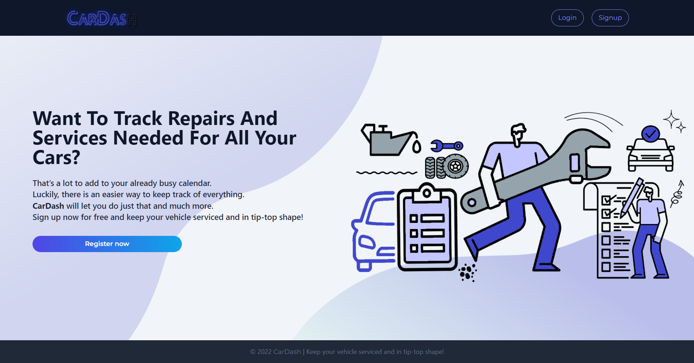

# car-dash

## Description

- CarDash is an application that allows the users to keep track of all repairs and services needed for their vehicles. A user can create an account and add as many cars as they wish.  

## Table of Contents

  - [Description](#description)
  - [Screenshot](#screenshot)
  - [Screencastify](#screencastify)
  - [Technologies Used](#technologies)
  - [Links](#links)
  - [Contributions](#contributions)
   
 

## Screenshot 

 

## Screencastify

 

## Technologies 

### Back-End

- Node.js
- Express
- MongoDB
- GraphQL
- Apollo Server
- Bcrypt
- JWT

### Front-End
- React
- React Dom
- React Router
- Jwt-decode
- TailwindCss

## Links

GitHub -  https://github.com/khaoulaja/car-dash

Live Site - https://limitless-reaches-44145.herokuapp.com/
 

## Contributions

CarDash created by Khaoula Jabour, Robert Field, and Javarris Barnett
